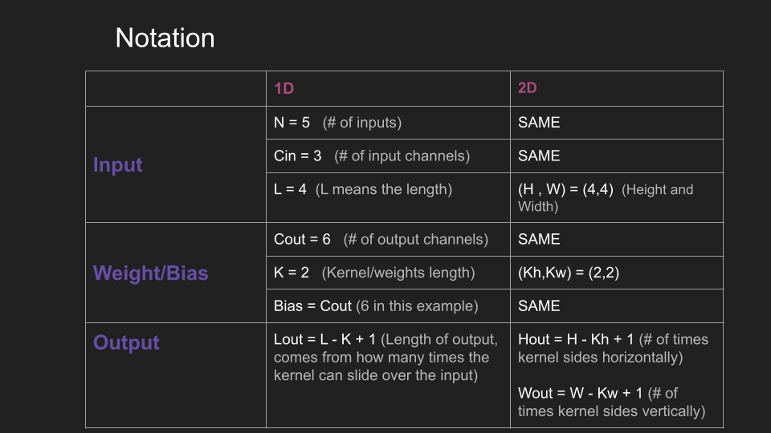
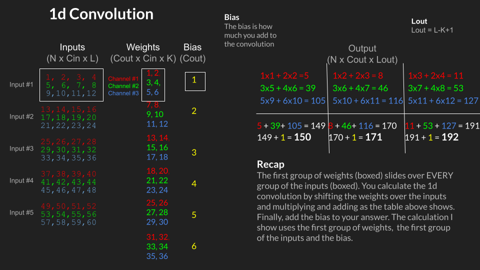
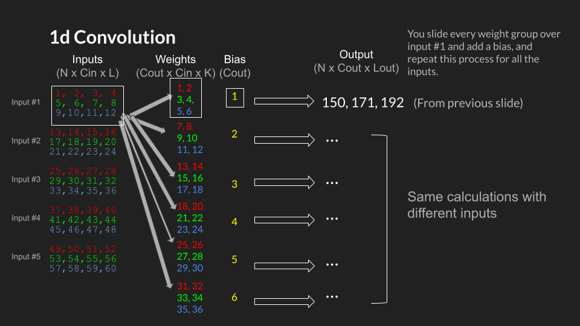
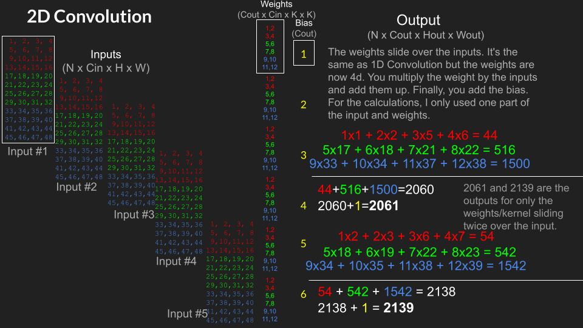
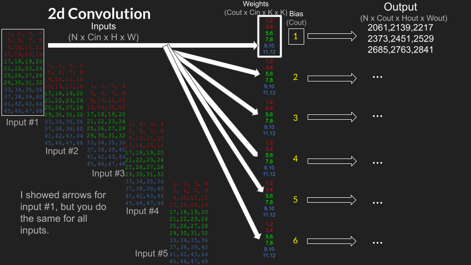

# 1d Convolution

The manual calculations of how to do 1d convolution are shown here. The input has a batch size (N) of 5, the number of input channels (Cin) is 3, and the length of the input (L) is 4. 

## Slide Show

The calculations below use the first weights/kernel and first inputs in the data. This was done earlier.

# 2d Convolution

