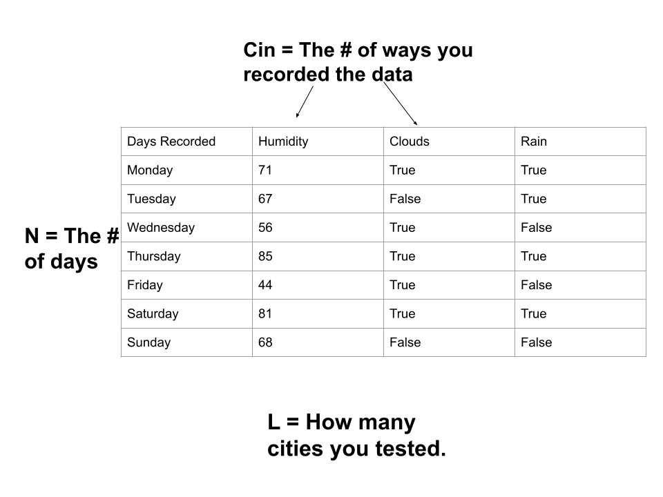

# Convolution 

Convolution is where we have a kernel and a input. We slide the kernel over the input, multiplying and adding the results (calculations show in slide show).

# 1d Convolution

Below are the slides to 1D Convolution.

N is the number of inputs. For example, its how many days you are recording.
L is the length. For example, its the number of cities you record.
Cin is the number of input channels. For example, its the number of ways you recorded the data.

The calculations below use the first weights/kernel and first inputs in the data. This was done earlier.

3D Visualization of 2D Convolution: https://adamharley.com/nn_vis/cnn/3d.html

Animations of 2D Convolution: https://hannibunny.github.io/mlbook/neuralnetworks/convolutionDemos.html

Image Kernels of 2D Convolution: https://setosa.io/ev/image-kernels/
